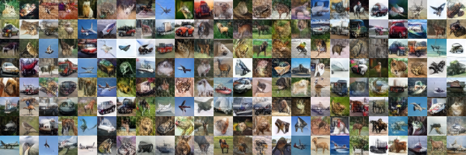
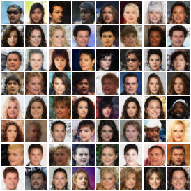

# deciphering-autoencoders
<https://arxiv.org/abs/2310.01712>

  


### Dataset
Download CIFAR-10 and store it in folder `./dataset`.<br>
Generate a number of random patterns corresponding to each data point as npz file by running `gen_masks.py`.<br>
Store the npz file in folder `./dataset`.

### Training (CIFAR-10)
Run `train.py` with default settings.<br>
Finetune the model by changing some training parameters as follows:
```shell
args.run_name = 'nf128_na1-4-16_nc32_finetune' \
args.epochs = 2000 \
args.warmup = False \
args.shift_range = 0 \
args.weight_path = 'PATH to initially trained model' \
```

### Training (CelebA)
Please refer to the paper.

### Testing
Run `sample.py`.
